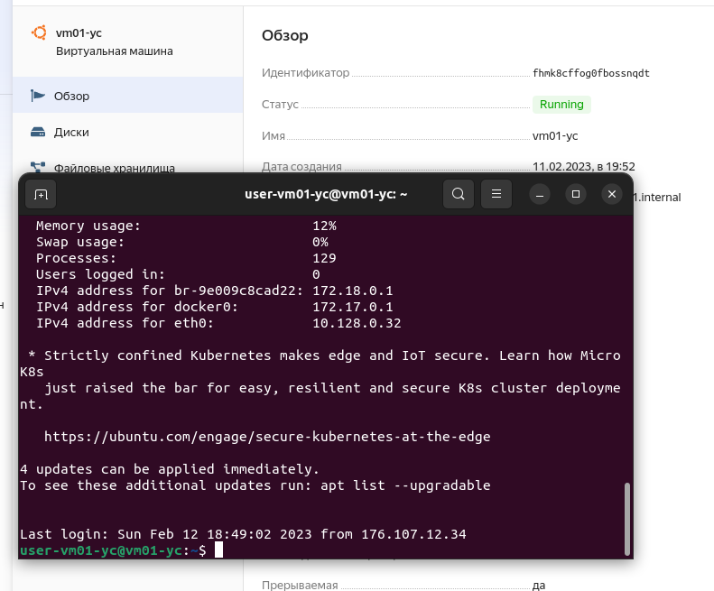

# postgresql_course lesson 2
Домашнее задание

Работа с уровнями изоляции транзакции в PostgreSQL
Цель:

    научиться работать с Google Cloud Platform на уровне Google Compute Engine (IaaS)ЯндексОБлаке на уровне Compute Cloud
    научиться управлять уровнем изоляции транзакций в PostgreSQL и понимать особенность работы уровней read commited и repeatable read


Описание/Пошаговая инструкция выполнения домашнего задания:

создать новый проект в Google Cloud Platform, например postgres2022-, где yyyymm год, месяц вашего рождения (имя проекта должно быть уникально на уровне GCP), Яндекс облако или на любых ВМ, докере
далее создать инстанс виртуальной машины с дефолтными параметрами
добавить свой ssh ключ в metadata ВМ
зайти удаленным ssh (первая сессия), не забывайте про ssh-add
поставить PostgreSQL
зайти вторым ssh (вторая сессия)
 
запустить везде psql из под пользователя postgres
выключить auto commit

```
postgres=# \echo :AUTOCOMMIT
on
postgres=# \set AUTOCOMMIT OFF
postgres=# \echo :AUTOCOMMIT
OFF
postgres=# 
```

сделать в первой сессии новую таблицу и наполнить ее данными create table persons(id serial, first_name text, second_name text); insert into persons(first_name, second_name) values('ivan', 'ivanov'); insert into persons(first_name, second_name) values('petr', 'petrov'); commit;

```
postgres=# create table persons(id serial, first_name text, second_name text);
CREATE TABLE
postgres=# nsert into persons(first_name, second_name) values('ivan', 'ivanov'); insert into persons(first_name, second_name) values('petr', 'petrov');
ERROR:  syntax error at or near "nsert"
LINE 1: nsert into persons(first_name, second_name) values('ivan', '...
        ^
INSERT 0 1
postgres=# insert into persons(first_name, second_name) values('ivan', 'ivanov'); insert into persons(first_name, second_name) values('petr', 'petrov');
INSERT 0 1
INSERT 0 1
postgres=# commit
postgres-# ;
WARNING:  there is no transaction in progress
COMMIT
postgres=# commit;
WARNING:  there is no transaction in progress
COMMIT
postgres=# 
```
посмотреть текущий уровень изоляции: show transaction isolation level
начать новую транзакцию в обоих сессиях с дефолтным (не меняя) уровнем изоляции
в первой сессии добавить новую запись insert into persons(first_name, second_name) values('sergey', 'sergeev');
сделать select * from persons во второй сессии
видите ли вы новую запись и если да то почему?
завершить первую транзакцию - commit;
сделать select * from persons во второй сессии
видите ли вы новую запись и если да то почему?
завершите транзакцию во второй сессии
начать новые но уже repeatable read транзации - set transaction isolation level repeatable read;
в первой сессии добавить новую запись insert into persons(first_name, second_name) values('sveta', 'svetova');
сделать select * from persons во второй сессии
видите ли вы новую запись и если да то почему?
завершить первую транзакцию - commit;
сделать select * from persons во второй сессии
видите ли вы новую запись и если да то почему?
завершить вторую транзакцию
сделать select * from persons во второй сессии
видите ли вы новую запись и если да то почему? 
```
в первом случае данные в другой сессии появляются только после фиксации

во втором случае вторая сессия видит только данные, которые были зафиксированы до нвчвла второй сессии

на вопрос почему: таково соглашение об уровне изоляций, а мы его изменили
```
ДЗ сдаем в виде миниотчета в markdown в гите


