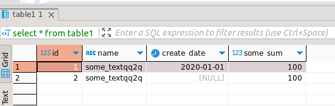
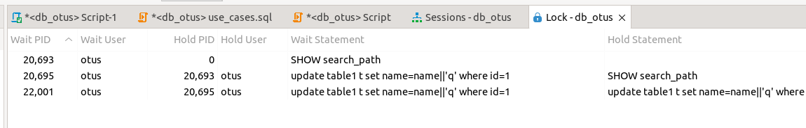
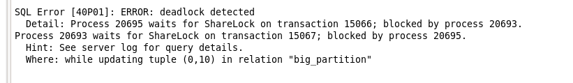

# postgresql_course lesson 10
## Домашнее задание

 1. Настройте сервер так, чтобы в журнал сообщений сбрасывалась информация о блокировках, удерживаемых более 200 миллисекунд. Воспроизведите ситуацию, при которой в журнале появятся такие сообщения.
    ```
    Для удобтва воспольовался стандартными инструментвми DBeaver Lock and Sessions Manager

    Перевел в режим manual commit 

    Использовал таблицу table1 см. ниже
    ```
    
2. Смоделируйте ситуацию обновления одной и той же строки тремя командами UPDATE в разных сеансах. Изучите возникшие блокировки в представлении pg_locks и убедитесь, что все они понятны. Пришлите список блокировок и объясните, что значит каждая
```
-- в 3 сессиях выполним один и тот же запрос
update table1 t set name=name||'q' where id=1;
-- т.е. попытаемся обновить одну и ту же запись
-- в lock manager видим следующее:  

```

```
-- 2ая транзакция ждет первую
-- 3ья ждет вторую
```
3. Воспроизведите взаимоблокировку трех транзакций. Можно ли разобраться в ситуации постфактум, изучая журнал сообщений?
```
достаточно двух транзакций, попробуем поменять в таблице местами имена в 1-ой транзакции 1 на 2 во 2-ой транзакции 2 на 1

1транзакция
update table1 t set name=(select name from table1 where id=2) where id=1;
update table1 t set name=(select name from table1 where id=1) where id=2;

2транзакция
update table1 t set name=(select name from table1 where id=1) where id=2;
update table1 t set name=(select name from table1 where id=2) where id=1;

получаем:
```

 ```
 На практике разобраться изучая журнал довольно сложно. Это коллизия для бд, если бы можно было разобраться формально, то этой проблемы не было бы. Проблема в том, что у этих транзакций м.б. одинаковое время и первопричину не установить
 ```
4. Могут ли две транзакции, выполняющие единственную команду UPDATE одной и той же таблицы (без where), заблокировать друг друга?
```
думаю нет, обойдется блокировкой с ожмданием. Т.к. таблиы скорее всего будут блокироваться целиком
```
