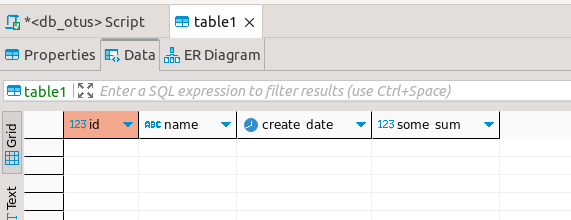
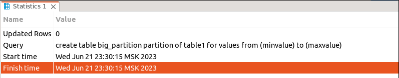
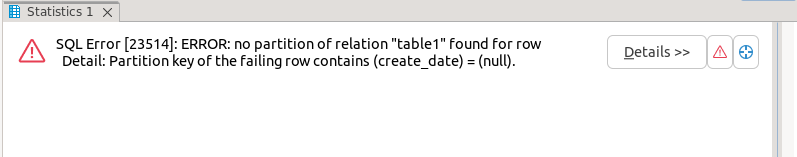
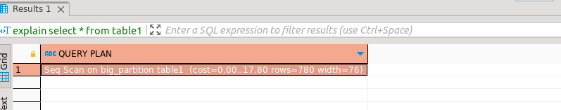
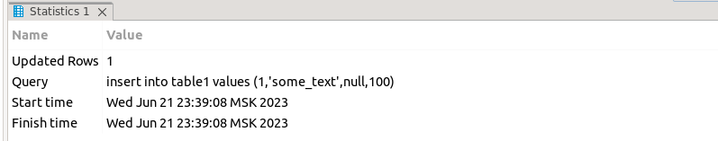
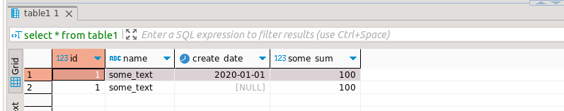
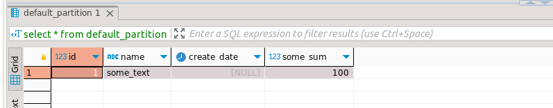
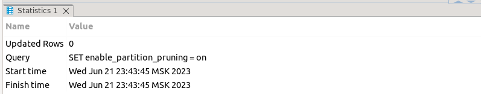
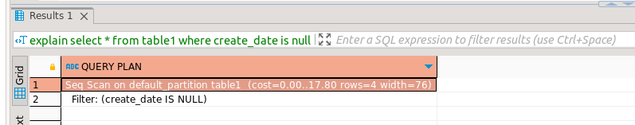

# postgresql_course lesson 20
## Домашнее задание


1. Секционировать большую таблицу из демо базы flights

Указанной таблицы не оказалось под рукой...
```  
create table table1 (
id bigserial,
name text,
create_date date,
some_sum numeric
)
partition by range (create_date);

```



```
create table big_partition partition of table1 for values from (minvalue) to (maxvalue);
```


```
insert into table1 values (1,'some_text',null,100);
```

```
explain
select * from table1;
```

```
insert into table1 values (1,'some_text',date'2020-01-01',100);
create table default_partition partition of table1 default;
insert into table1 values (1,'some_text',null,100);
```

```
select * from table1;
```

```
select * from default_partition;
```

```
SET enable_partition_pruning = on;
```

```
explain
select *
from table1
where create_date is null;
```
